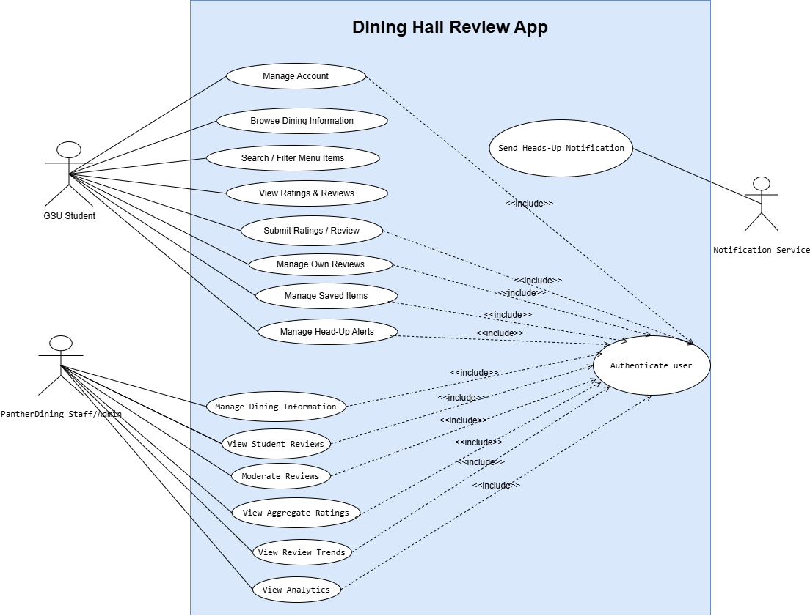

## Architecture and Tech Decisions

The recommended architecture is a three-tier web architecture: presentation layer, application/API layer, and relational data layer. This matches the team's separation of frontend, backend, database, and testing responsibilities.
| **Layer/Technology** | **Choice** | **Reason** |
|----------------------|--------------------------------------------------------|-------------------------------------------------------|
| Frontend | React + JavaScript/TypeScript + HTML/CSS | Build the responsive GUI, navigation, search/filter controls, review forms, saved-item screens, and staff dashboard. |
| Backend | Java + Spring Boot + REST API | Implement authentication/authorization, review rules, filtering, aggregation, saved items, heads-up logic, and admin functions. |
| Database | MySQL | Store normalized relational data for users, halls, stations, items, reviews, tags, saved items, availability, and notification events. |
| Data Access | Spring Data JPA / Hibernate | Map Java domain objects to relational tables and reduce repetitive database-access code |
| Testing | JUnit + Spring Boot Test, frontend component tests as appropriate | Test business rules, API endpoints, integration behavior, and critical UI workflows. |
| Version Control | Git/GitHub | Coordinate team development, code review, and configuration management. |
| Deployment/Cloud | Cloud-hosted application and managed MySQL instance | Provide a shared environment for the team and final demonstration, exact provider can be selected based on course constraints. |
| Notifications | Email or browser notification provider | Deliver heads-up alerts, provider choice depends on available project infrastructure. |
### Flow
Student/Staff browser -> React frontend -> Spring Boot REST API -> MySQL database

Spring Boot applies authorization and business rules before reading or modifying database records.

Heads-up scheduler/service checks scheduled menu availability against active subscriptions and sends notifications through the selected notification service.

Staff analytics are generated from stored review history and aggregate queries rather than from manually collected feedback.

## Use Case Diagram

The following UML use case diagram shows the primary roles and tasks
within the Dining Hall Review App. The main actors are GSU Student,
PantherDining Staff/Admin users, and the external Notification Service.

